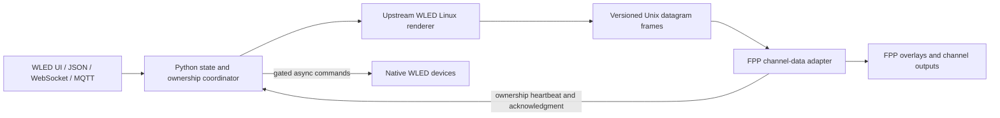

# Architecture

The engine is a single-threaded shared library inside a supervised process, never inside FPP. Linux shims supply monotonic render time, memory, seeded random numbers, virtual buses and embedded fonts. Preparation extracts exact pinned upstream math/utilities and replaces embedded bus initialization, filesystem maps and palette loading. A pointer-width correction replaces the ESP-specific 32-bit palette-pointer read. The state/API layer is a compatibility implementation, not a wholesale port of WLED's embedded web server.

The FPP adapter compiles against installed headers and validates ABI fingerprints before activation. Its worker handles sockets, frame decoding, bounded allocations, acknowledgment and ownership observation. `modifySequenceData` runs before overlays; it checks current show state and fresh ambient data and uses a nonblocking lock. Rendering, plugin-owned waits, HTTP and socket operations stay off that callback. Idle forcing is balanced when ambient begins/ends. Previously contributed ambient ranges are cleared while idle after revocation/failure so stale pixels do not remain in FPP's persistent buffer; show data is never cleared by this path.

Wire format version 1 is little-endian. Frames have `WLF1`, version/allowed u16, serial/monotonic-ns/session-nonce u64, mapping-count/pixel-byte-count u32; each mapping is three u32 values (zero-based destination byte, source byte, length), followed by pixel bytes. Limits are 256 ranges and 64,000 bytes, checked before use. Observer packets have `FPO1`, version/flags u16, monotonic timestamp/session nonce/ack serial u64. Flags are playlist 1, sequence 2, bridge/live 4, unknown 8 and acknowledged-allowed 16. A new adapter nonce invalidates old frames. Both sides reject stale/future observations. The output adapter uses a 500 ms maximum frame age; configured observer timeout may be stricter.

Explicit lock and ambient-enabled state is atomically persisted with fsync. Ownership faults fail closed. A successful Show Start also waits for native requests already dispatched to finish and for a denied frame acknowledgment. Direct show producers must wait for this response. Existing native device effects are not remotely paused by the gate; show streams must own those targets.

State, preset, playlist, native-command, native-snapshot, auth and configuration files live outside immutable release trees. The installer builds before switching the runtime symlink. It never restarts FPP automatically. Unknown ownership prevents ambient output while FPP reloads the plugin.

Native effect-mode recovery shares the bounded device worker pool and per-device command locks. Two-second ambient polls create lighting-only checkpoints; epoch/generation checks reject responses overtaken by a show or newer command. Explicit Show Start adds a bounded read-only capture after draining commands. Timed-out capture responses cannot replace the checkpoint. Recovery checks device identity and realtime status before each write and retries independently while ambient remains allowed. Checkpoints record the desired command they observed so an older snapshot cannot supersede a newer persisted command after a crash. Native playlist selection can be restarted, but its unexposed playback cursor cannot be reconstructed.
